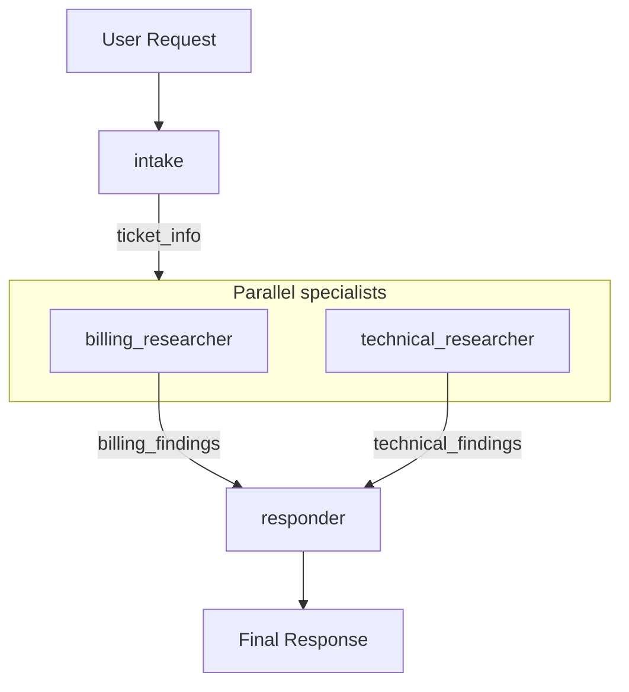

# ADK Certification — Resources & Hands-on

Google Agent Development Kit (ADK) learning project organized by track.
Each agent folder is a self-contained demo of one concept.

## Learning paths

| Track | Path | Focus |
|-------|------|-------|
| `foundational/` — Foundational (single-agent) | [Develop Agents with Agent Development Kit (ADK)](https://www.skills.google/paths/3545) | Single LlmAgent concepts — setup, instructions, session state, tools, and MCP integration. |
| `multi_agent/` — Multi-agent | [Multi-Agent ADK](https://www.skills.google/paths/3877) | Orchestration patterns — sub-agents, pipelines, and coordinated multi-agent workflows. |
| `deployment/` — Deployment | [Deploy ADK Agents to Google Cloud](https://google.github.io/adk-docs/deploy/) | Agent Engine and Cloud Run — deploy commands, platform comparison, and production session persistence. |

- **Foundational (single-agent)** (`foundational/`): [Path 3545](https://www.skills.google/paths/3545)
  - Badge: [Engineer AI Agents with Agent Development Kit (ADK)](https://www.credly.com/badges/14b4692b-b475-4b7f-adab-2b4ca2d532c2)
- **Multi-agent** (`multi_agent/`): [Path 3877](https://www.skills.google/paths/3877)
- **Deployment** (`deployment/`): [Deploy ADK Agents to Google Cloud](https://google.github.io/adk-docs/deploy/)

## Quick start

```bash
python -m venv .venv
source .venv/bin/activate
pip install google-adk python-dotenv pyyaml
pip install 'mcp>=1.0,<2'  # MCP tools (foundational/file_reader_mcp)
pip install 'google-adk[a2a]'  # A2A protocol (multi_agent/a2a_demo)
pip install 'google-cloud-aiplatform[adk,agent_engines]>=1.111'  # deployment/

# Per agent:
cp <track>/<agent_folder>/.env.example <track>/<agent_folder>/.env
# Edit .env with your GOOGLE_API_KEY

adk web .                                    # browse all agents
adk run foundational.geography_assistant     # one agent (dot path)
python foundational/geography_assistant/test_tools.py
```

## Project structure

```text
google-adk-certification-resource-and-hands-on/
├── agents.yaml
├── course_template.py       # shared helper (state templating)
├── scripts/sync_adk_agent_docs.py
├── foundational/              # Path 3545 — single-agent
│   ├── simple_agent_module1/
│   ├── geography_assistant/
│   └── ...
├── multi_agent/               # Path 3877 — multi-agent
│   ├── customer_service/
│   ├── sequential_pipeline/
│   ├── ...
│   └── customer_service_app_multi_agent/  # capstone
└── deployment/                # GCP deploy (Agent Engine, Cloud Run)
    └── weather_agent/           # hands-on deploy
```

Sync docs after adding agents:

```bash
python scripts/sync_adk_agent_docs.py
```

## Foundational (single-agent) (`foundational/`)

[Path 3545](https://www.skills.google/paths/3545) — Single LlmAgent concepts — setup, instructions, session state, tools, and MCP integration.

### Modules 1–2 Recap

Session state is a dictionary. output_key writes agent output to state. {key} templating reads state into instructions.

**How long does state persist?** → State namespaces control persistence scope — not all state should live forever.

You can now:
- Use `session.state` as a dictionary
- Use `output_key` to save agent responses to state
- Use `{key}` templating to inject state into instructions

### State namespaces

| Prefix | Lifetime | Example |
|--------|----------|---------|
| `temp:` | Current turn only | `temp:step = validating` |
| (none) | Current session | `topic = refunds` |
| `user:` | All sessions for user | `user:theme = dark` |
| `app:` | Global for app | `app:version = 2.0` |

### ADK tool types

| Type | Complexity | Setup | Use when | Example |
|------|------------|-------|----------|---------|
| Built-in | Low | Import and use | Common capabilities (search, code execution, RAG) | `google_search` |
| Function Tools | Medium | Write Python function | Custom business logic | `get_capital_city` |
| Agent-as-Tool | Medium-High | Specialized sub-agent | Specialized reasoning (e.g. Google Search + other tools) | `GoogleSearchAgentTool` |

**Note:** `google_search` is a built-in tool and cannot be combined
with custom function tools on the same agent directly. Use
`GoogleSearchTool(bypass_multi_tools_limit=True)` to wrap it as a
sub-agent (`GoogleSearchAgentTool`).

### MCP tools

Official MCP server catalog: [https://registry.modelcontextprotocol.io](https://registry.modelcontextprotocol.io)

| Connection | Use for |
|------------|---------|
| `StdioConnectionParams` | Local servers via subprocess (development) |
| `SseConnectionParams` | Remote servers via HTTP (production) |

### Memory Bank — cross-session memory

While session state tracks one conversation, Memory Bank is long-term knowledge the agent can recall across all past chats. It answers: "What have I learned ACROSS ALL conversations?"

| | Session state | Memory Bank |
|---|---------------|-------------|
| Question | What's happening THIS conversation? | What have I learned ACROSS ALL conversations? |

**Lifecycle (conceptual):**

1. User interacts with agent
2. Conversation saved to Memory Bank (automatic via after_agent_callback)
3. LLM extracts meaningful information — preferences, interests, facts (not raw logs)
4. Later conversation — agent uses load_memory to search past memories
5. Agent responds with historical context

**Key features:**

- **LLM-powered extraction** — Intelligently extracts and consolidates facts from conversations — not raw transcript storage.
- **Semantic search** — Understands intent when retrieving memories — not just keyword matching.
- **Managed service** — VertexAiMemoryBankService on GCP — no infrastructure setup; connects via Agent Engine (agentengine://AGENT_ENGINE_ID).

**Local vs production:**

| | InMemoryMemoryService | VertexAiMemoryBankService |
|---|-------|------------|
| Use | Prototyping and learning the memory API locally | Production cross-session memory with extraction and semantic search |

- **Save:** `after_agent_callback → callback_context.add_session_to_memory()`
- **Recall:** `load_memory tool (or preload_memory for automatic preload each turn)`

**Production config:**

```bash
adk web path/to/agents --memory_service_uri="agentengine://AGENT_ENGINE_ID"
```

Demo: `foundational/memory_bank/`
[ADK memory docs](https://google.github.io/adk-docs/sessions/memory/)

### Agents

Browse every agent in the web UI from the repo root: `adk web .` (select e.g. `foundational.<agent_folder>`). Per-agent commands below.

#### `foundational/simple_agent_module1` — Simple agent & programmatic runner

- **Module:** Module 1–3
- **Agent name:** `math_tutor`
- **ADK name:** `foundational.simple_agent_module1`
- **How to run:**
  - `adk run foundational/simple_agent_module1`
  - `python foundational/simple_agent_module1/agent.py` (programmatic test)
- **Try asking:**
  - "What is 2x + 5 = 13?"
- **What we learned:**
  - Basic LlmAgent / Agent setup with gemini-3.6-flash
  - Agent folder naming (underscores, valid Python identifiers)
  - Running via adk run, adk api_server, and curl /run
  - Programmatic Runner + InMemorySessionService
  - load_dotenv and session state from environment variables

#### `foundational/agent_with_yaml` — Declarative agent configuration

- **Module:** Module — YAML
- **Agent name:** `root_agent`
- **ADK name:** `foundational.agent_with_yaml`
- **How to run:**
  - `adk run foundational/agent_with_yaml`
- **Try asking:**
  - "How do I solve x² - 5x + 6 = 0?"
- **What we learned:**
  - Define agents in root_agent.yaml instead of agent.py
  - Instruction, model, and metadata without Python code
  - Same adk web / adk run workflow as code-based agents

#### `foundational/customer_support_agent` — Optimized instruction design

- **Module:** Module — Instructions
- **Agent name:** `support_specialist`
- **ADK name:** `foundational.customer_support_agent`
- **How to run:**
  - `adk run foundational/customer_support_agent`
- **Try asking:**
  - "My order #4521 hasn't arrived yet and I need it by Friday"
- **What we learned:**
  - Structured prompts (identity, mission, methodology, boundaries)
  - Persona and tone control for production-style agents
  - load_dotenv for API credentials

#### `foundational/product_extractor` — Pydantic output_schema & output_key

- **Module:** Module — Structured output
- **Agent name:** `product_extractor`
- **ADK name:** `foundational.product_extractor`
- **How to run:**
  - `adk run foundational/product_extractor`
- **Try asking:**
  - "I bought the iPhone 15 Pro 256GB in blue for $999"
- **What we learned:**
  - Pydantic models to enforce JSON response shape
  - output_schema validates model output automatically
  - output_key stores parsed result in session state for reuse

#### `foundational/model_comparison` — generate_content_config tuning

- **Module:** Module — Model config
- **Agent name:** `data_extractor / creative_brainstormer`
- **ADK name:** `foundational.model_comparison`
- **How to run:**
  - `adk run foundational/model_comparison`
- **Try asking:**
  - "data_extractor: Extract facts from — The Eiffel Tower is 330 meters tall and was completed in 1889."
  - "creative_brainstormer: Brainstorm 5 names for a sustainable coffee brand"
- **What we learned:**
  - temperature, top_p, top_k for factual vs creative behavior
  - max_output_tokens and multi-agent comparison patterns
  - safety_settings (HarmCategory, HarmBlockThreshold)

#### `foundational/problem_solver_reasoning_agent` — BuiltInPlanner & thinking

- **Module:** Module — Planning
- **Agent name:** `strategic_problem_solver`
- **ADK name:** `foundational.problem_solver_reasoning_agent`
- **How to run:**
  - `adk run foundational/problem_solver_reasoning_agent`
- **Try asking:**
  - "How can a small startup compete with established market leaders?"
- **What we learned:**
  - BuiltInPlanner with ThinkingConfig for Gemini models
  - include_thoughts and thinking_budget for visible reasoning
  - When to use BuiltInPlanner vs PlanReActPlanner

#### `foundational/name_extractor_memory` — output_key & session memory

- **Module:** Module — Session state
- **Agent name:** `name_extractor`
- **ADK name:** `foundational.name_extractor_memory`
- **How to run:**
  - `adk run foundational/name_extractor_memory`
  - `python foundational/name_extractor_memory/test_state.py` (programmatic test)
- **Try asking:**
  - "Hi, my name is Alex Johnson"
  - "What's my name? (follow-up in same session)"
- **What we learned:**
  - output_key saves agent response to session.state automatically
  - Access state programmatically via session.state.get("user_name")
  - State persists across multiple turns in the same session
  - Programmatic testing with Runner and InMemorySessionService

#### `foundational/memory_bank` — Cross-session memory — load_memory + auto-save callback

- **Module:** Module — Memory Bank
- **Agent name:** `memory_assistant`
- **ADK name:** `foundational.memory_bank`
- **How to run:**
  - `adk run foundational/memory_bank`
  - `python foundational/memory_bank/test_memory.py` (programmatic test)
- **Try asking:**
  - "My favorite color is blue and I love hiking on weekends."
  - "What do you remember about my hobbies and favorite color? (new session)"
- **What we learned:**
  - Session state = this conversation; Memory Bank = across all conversations
  - after_agent_callback + add_session_to_memory saves turns automatically
  - load_memory tool searches past conversations semantically
  - Production uses VertexAiMemoryBankService (LLM extraction, managed GCP)
  - Local demo uses InMemoryMemoryService with the same Runner API pattern

#### `foundational/personalized_greeter` — {key} instruction templating

- **Module:** Module — State templating
- **Agent name:** `personalized_greeter`
- **ADK name:** `foundational.personalized_greeter`
- **How to run:**
  - `adk run foundational/personalized_greeter`
  - `python foundational/personalized_greeter/test_templating.py` (programmatic test)
- **Try asking:**
  - "Hello (first turn — no name in state yet)"
  - "Hello again (after name is saved to session state)"
- **What we learned:**
  - Inject session.state into instructions with {key} syntax
  - Optional defaults with {key?default} and conditional blocks
  - ADK resolves templates before sending instructions to the LLM
  - Instructions adapt dynamically based on available state

#### `foundational/namespace_demo` — temp / session / user / app scopes

- **Module:** Module — State namespaces
- **Agent name:** `namespace_demo`
- **ADK name:** `foundational.namespace_demo`
- **How to run:**
  - `adk run foundational/namespace_demo`
  - `python foundational/namespace_demo/test_namespaces.py` (programmatic test)
- **Try asking:**
  - "Show me the namespace values"
  - "What persisted from my last session? (new session)"
- **What we learned:**
  - Four state namespaces with different persistence lifetimes
  - {'temp': 'current turn only, session (no prefix) per conversation'}
  - {'user': 'persists across sessions for same user'}
  - {'app': 'global config shared by all users'}

#### `foundational/geography_assistant` — Function tools + Google Search

- **Module:** Module — Tools
- **Agent name:** `geography_assistant`
- **ADK name:** `foundational.geography_assistant`
- **How to run:**
  - `adk run foundational/geography_assistant`
  - `python foundational/geography_assistant/test_tools.py` (programmatic test)
- **Try asking:**
  - "What is the capital of France?"
  - "What is the current population of Tokyo?"
- **What we learned:**
  - Custom function tools with Python functions and docstrings
  - Built-in google_search tool for live web facts
  - google_search cannot mix with function tools on one agent without bypass_multi_tools_limit
  - ADK wraps Google Search as a sub-agent when combined with custom tools

#### `foundational/file_reader_mcp` — McpToolset + filesystem server

- **Module:** Module — MCP tools
- **Agent name:** `file_reader_assistant`
- **ADK name:** `foundational.file_reader_mcp`
- **How to run:**
  - `adk run foundational/file_reader_mcp`
  - `python foundational/file_reader_mcp/test_mcp.py` (programmatic test)
- **Try asking:**
  - "List all files in the allowed folder"
  - "Read the contents of hello.txt"
- **What we learned:**
  - Connect to MCP servers via McpToolset (stdio or SSE)
  - Browse MCP catalog at registry.modelcontextprotocol.io
  - StdioConnectionParams — local subprocess (development, e.g. npx)
  - SseConnectionParams — remote HTTP/SSE (production)
  - tool_filter limits exposed tools to safe read-only operations
  - Requires Node.js/npm and pip install 'mcp>=1.0,<2' (MCP SDK)

## Multi-agent (`multi_agent/`)

[Path 3877](https://www.skills.google/paths/3877) — Orchestration patterns — sub-agents, pipelines, and coordinated multi-agent workflows.

### Multi-agent patterns

**Coordinator** (`sub_agents` on `LlmAgent`) — LLM decides which specialist handles each request. See `customer_service/`.

### Workflow agents (deterministic)

Workflow agents coordinate sub-agents in a fixed, predictable pattern. Unlike the coordinator pattern (LLM decides routing), workflow agents provide deterministic execution.

**Use cases:**
- Pipelines — intake → process → respond (fixed order)
- Parallel tasks — research from multiple sources at once (for speed)
- Refinement — check quality, improve, repeat until good enough

| Type | Pattern | Use when | Demo |
|------|---------|----------|------|
| `SequentialAgent` | A → B → C | Fixed order; each step needs previous output | `multi_agent/sequential_pipeline/` |
| `ParallelAgent` | A + B + C | Independent tasks; run concurrently for speed | `multi_agent/parallel_research/` |
| `LoopAgent` | (A → B) × N | Iterative refinement, quality loops, retry patterns | `multi_agent/refinement_loop/` |

#### SequentialAgent (`A → B → C`)

Fixed order; each step needs previous output.

- Agents run in list order; each waits for the previous to finish
- output_key saves output; {key} reads from state
- [ADK docs](https://google.github.io/adk-docs/agents/workflow-agents/sequential-agents/)

#### ParallelAgent (`A + B + C`)

Independent tasks; run concurrently for speed.

- All sub-agents start at approximately the same time
- Each branch needs a distinct output_key
- Waits for all branches to complete
- [ADK docs](https://google.github.io/adk-docs/agents/workflow-agents/parallel-agents/)

#### LoopAgent (`(A → B) × N`)

Iterative refinement, quality loops, retry patterns.

- Repeats sub-agents until max_iterations (always set this!)
- Each iteration can use output from the previous pass
- [ADK docs](https://google.github.io/adk-docs/agents/workflow-agents/loop-agents/)

### Choosing the right workflow agent

| Situation | Use this | Why |
|-----------|----------|-----|
| Steps depend on each other | `SequentialAgent` | Each step needs previous output |
| Steps are independent | `ParallelAgent` | Faster — run at the same time |
| Need to repeat until done | `LoopAgent` | Iterative refinement |

#### Coordinating state with ParallelAgent

- Always use a distinct output_key for each parallel agent
- Follow with an aggregator agent to combine results via {key} templating
- Wrap in SequentialAgent — parallel stage first, then aggregator
- Demo: `multi_agent/balanced_research/` — `SequentialAgent([ParallelAgent(...), aggregator])`
- [ADK workflow agents docs](https://google.github.io/adk-docs/agents/workflow-agents)

### Agent communication (shared state)

Agents communicate by reading from and writing to shared session state. Without state, each agent works in isolation — the writer cannot see the researcher's output.

**Primary pattern:** output_key — saves agent response to session.state; {key} — ADK injects state value into instruction before the agent runs.

**Data flow:** Researcher → state[research_findings] → Writer → state[draft_article] → Editor.

| Pattern | Use when | Demo |
|---------|----------|------|
| `output_key + {key}` | Data flowing through pipelines (most common) | `multi_agent/research_pipeline/` |
| `sub_agents (LLM routing)` | Dynamic routing based on request content | `multi_agent/customer_service/` |
| `RemoteA2aAgent (A2A)` | Remote agent on another service, team, or network | `multi_agent/a2a_demo/` |
| `AgentTool` | Explicit control, specialized subtasks | `foundational/geography_assistant/` |

[ADK docs — multi-agent communication](https://google.github.io/adk-docs/agents/multi-agents#communication)

### Capstone: Customer Service Multi-Agent App

Capstone: intake → parallel billing + technical research → final response. Full pipeline in multi_agent/customer_service_app_multi_agent/agent.py.

**Build steps:**
1. `intake` — Extract ticket details from user request (`done`)
2. `parallel_specialists` — billing_researcher + technical_researcher run concurrently (`done`)
3. `responder` — Create final response from all state keys (`done`)



**State communication:**

| Agent | Role | Writes to state | Reads from state |
|-------|------|-----------------|------------------|
| `intake` | Extract ticket info | `ticket_info` | user request |
| `billing_researcher` | Research billing issues | `billing_findings` | ticket_info |
| `technical_researcher` | Research technical issues | `technical_findings` | ticket_info |
| `responder` | Create final response | — | ticket_info, billing_findings, technical_findings |

Folder: `multi_agent/customer_service_app_multi_agent/` — `adk run multi_agent.customer_service_app_multi_agent`

**Test scenarios:**

#### Test 1 — Billing issue

**You:**

> I was charged twice for my subscription last month. The charge was on December 15th.

**Expected flow:**
1. Intake extracts: billing issue, duplicate charge, December 15th date
2. Billing researcher finds relevant billing policies
3. Technical researcher says no technical issues
4. Response agent creates a helpful billing-focused answer

#### Test 2 — Technical issue

**You:**

> The app crashes every time I try to upload a photo. I'm using an iPhone 14.

**Expected flow:**
1. Intake extracts: technical issue, upload crash, iPhone 14
2. Billing researcher says no billing issues
3. Technical researcher finds troubleshooting steps
4. Response agent creates a helpful technical answer

#### Test 3 — Both billing and technical

**You:**

> I can't log in to my account and I think I'm being charged even though I canceled.

**Expected flow:**
1. Intake extracts: both billing AND technical issues
2. Billing researcher investigates the charging issue
3. Technical researcher investigates the login issue
4. Response agent addresses both issues

### State namespaces in multi-agent workflows

Effective state management lets workflows maintain context, respect user preferences, and coordinate parallel execution. All agents in a workflow share one session state — output_key writes, {key} reads, state accumulates.

| Namespace | Workflow use | Examples |
|-----------|--------------|----------|
| (session) | Workflow outputs and intermediate results | `d`, `o`, `c`, `u`, `m`, `e`, `n`, `t`, `_`, `c`, `o`, `n`, `t`, `e`, `n`, `t`, `,`, ` `, `t`, `o`, `p`, `i`, `c`, `s`, `,`, ` `, `s`, `e`, `n`, `t`, `i`, `m`, `e`, `n`, `t`, `,`, ` `, `s`, `u`, `m`, `m`, `a`, `r`, `y` |
| user: | User preferences that affect processing | `u`, `s`, `e`, `r`, `:`, `s`, `u`, `m`, `m`, `a`, `r`, `y`, `_`, `f`, `o`, `r`, `m`, `a`, `t` |
| app: | Global configuration for workflows | `a`, `p`, `p`, `-`, `w`, `i`, `d`, `e`, ` `, `d`, `e`, `f`, `a`, `u`, `l`, `t`, `s` |
| temp: | Rarely needed in basic workflows | `t`, `u`, `r`, `n`, `-`, `s`, `c`, `o`, `p`, `e`, `d`, ` `, `s`, `c`, `r`, `a`, `t`, `c`, `h`, ` `, `v`, `a`, `l`, `u`, `e`, `s` |

**Parallel state coordination:**

- Use distinct output_key for each parallel agent
- Aggregator reads all keys using {key} templating
- State is merged after the parallel stage completes
- Demo: `multi_agent/doc_processor/`
- [ADK state docs](https://google.github.io/adk-docs/sessions/state)

**Test scenarios:**

#### Test 1 — Process a document

**You:**

> Process this document: "The new product launch exceeded expectations. Sales jumped 40% in the first week. Customer feedback has been overwhelmingly positive, with 95% satisfaction ratings."

**Expected:**
1. Intake extracts and structures content
2. Topic and sentiment analyzers run in parallel
3. Summarizer creates summary (default bullet points — no user preference set)
4. All state preserved for follow-up questions

#### Test 2 — Follow-up in same conversation

**You:**

> What topics did you identify?

**Expected:**
1. Agent references topics from session state in the same conversation

### When to use custom agents (BaseAgent)

Default to workflow agents. Only use custom agents when you've confirmed that Sequential, Parallel, and Loop cannot handle your conditional logic.

**Rare scenarios requiring custom logic:**

- **Conditional skipping** — `IF condition THEN skip Agent B and go directly to Agent C`
  - Workflow agents run every sub-agent in their pattern
- **Dynamic routing** — `IF type == billing THEN billing_agent ELSE general_agent`
  - Workflow agents cannot branch based on runtime conditions
- **Complex early exit** — `IF quality_score > 8 THEN exit loop early`
  - LoopAgent max_iterations is not enough for complex exit logic

**Decision framework:**

1. Can I solve this with Sequential / Parallel / Loop?
1. Do I need conditional logic?
   - Simple if/else → Consider a custom agent
   - Complex logic → Use a custom agent (advanced)

**Trade-offs:**

| Factor | Workflow agents | Custom agents |
|--------|-----------------|---------------|
| Maintenance | Maintained by ADK | You maintain it |
| Testing | Standard patterns | Custom test cases |
| Debugging | Clear execution flow | More complex flow |

**Preview pattern:** Subclass BaseAgent, implement async _run_async_impl(ctx), read state, yield events from the chosen sub-agent run_async(ctx).
Demo: `multi_agent/conditional_router/`
[ADK custom agents docs](https://google.github.io/adk-docs/agents/custom-agents)

```python
class ConditionalRouter(BaseAgent):
    async def _run_async_impl(self, ctx):
        request_type = ctx.session.state.get('request_type')
        if request_type == 'billing':
            async for event in self.find_sub_agent('billing').run_async(ctx):
                yield event
        else:
            async for event in self.find_sub_agent('general').run_async(ctx):
                yield event
```

### Agent2Agent (A2A) Protocol

A2A is an open standard that lets agents communicate across networks, services, and organizational boundaries. Instead of importing another agent as Python code, one agent calls another over HTTP using a shared contract called an agent card.

**Core concepts:**

| Concept | What it means |
|---------|---------------|
| **Expose (server)** | Make your agent available to others as an A2A service. In ADK, wrap with to_a2a(agent) and serve via uvicorn, or use adk api_server --a2a. |
| **Consume (client)** | Let your agent call a remote A2A agent. In ADK, add a RemoteA2aAgent sub-agent with the remote agent card URL. |
| **Agent card** | JSON metadata (name, description, capabilities, skills, url) that describes what the remote agent can do. Served at /.well-known/agent-card.json. |

**When to use A2A:**
- Microservices — agents deployed as separate services
- Cross-team or cross-organization collaboration
- Different languages or runtimes (not all agents in one Python process)
- Agents on different networks or cloud environments

**When you do NOT need A2A:**
- Learning ADK basics — start with sub_agents in one codebase
- Single application where all agents live in the same repo
- Same team, same deployment — sub_agents or workflow agents are simpler
- Performance-critical local coordination — A2A adds network overhead

**Two-agent architecture (this repo):**

```text
┌─────────────────────────┐     A2A HTTP      ┌──────────────────────────────┐
│  research_coordinator   │ ────────────────▶ │  research_specialist         │
│  (local — adk run)      │   agent card +    │  (remote — uvicorn :8001)    │
│  RemoteA2aAgent         │   protocol        │  to_a2a(root_agent)          │
└─────────────────────────┘                   └──────────────────────────────┘
```

- **Local:** research_coordinator (LlmAgent + RemoteA2aAgent)
- **Remote:** research_specialist (LlmAgent exposed via to_a2a + uvicorn :8001)
- **Flow:** Coordinator delegates → HTTP/A2A → Remote specialist responds

**Run the demo:**

```bash
pip install 'google-adk[a2a]'
```

Demo folder: `multi_agent/a2a_demo/`

```bash
uvicorn multi_agent.a2a_demo.remote_research_specialist.agent:a2a_app --host localhost --port 8001
adk run multi_agent/a2a_demo
```

Verify the remote agent card: `http://localhost:8001/.well-known/agent-card.json`
- Use port 8001 for the remote A2A server so it does not conflict with adk web (default port 8000).

**References:**

- [A2A protocol](https://a2a-protocol.org/)
- [ADK A2A overview](https://google.github.io/adk-docs/a2a/)
- [Exposing an agent](https://google.github.io/adk-docs/a2a/quickstart-exposing/)
- [Consuming a remote agent](https://google.github.io/adk-docs/a2a/quickstart-consuming/)

### Agents

Browse every agent in the web UI from the repo root: `adk web .` (select e.g. `multi_agent.<agent_folder>`). Per-agent commands below.

#### `multi_agent/customer_service` — Coordinator + billing & technical specialists

- **Module:** Module — Multi-agent hierarchy
- **Agent name:** `customer_service_coordinator`
- **ADK name:** `multi_agent.customer_service`
- **How to run:**
  - `adk run multi_agent/customer_service`
- **Try asking:**
  - "I was charged twice on my last invoice"
  - "The app crashes when I try to log in"
  - "What are your business hours?"
- **What we learned:**
  - Single agents get overwhelmed when one instruction covers many domains
  - sub_agents creates a parent-child hierarchy with specialist children
  - Coordinator routes billing vs technical questions to the right expert
  - Each agent has at most one parent; use agent.find_agent(name) to navigate

#### `multi_agent/sequential_pipeline` — SequentialAgent — intake → analyze → respond

- **Module:** Module — Workflow agents
- **Agent name:** `request_pipeline`
- **ADK name:** `multi_agent.sequential_pipeline`
- **How to run:**
  - `adk run multi_agent/sequential_pipeline`
- **Try asking:**
  - "Help me plan a team offsite for 20 people in Austin"
- **What we learned:**
  - SequentialAgent runs sub-agents in fixed list order (A → B → C)
  - output_key saves each step to session state for the next step
  - {key} templating reads previous step output — deterministic, not LLM routing
  - Use when each step must finish before the next begins

#### `multi_agent/parallel_research` — ParallelAgent + SequentialAgent — parallel research → summarize

- **Module:** Module — Workflow agents
- **Agent name:** `research_pipeline`
- **ADK name:** `multi_agent.parallel_research`
- **How to run:**
  - `adk run multi_agent/parallel_research`
- **Try asking:**
  - "Give me an overview of renewable energy pros and cons"
- **What we learned:**
  - ParallelAgent runs sub-agents concurrently for speed
  - Each parallel branch needs a distinct output_key to avoid state conflicts
  - Nest ParallelAgent inside SequentialAgent when parallel work precedes a merge step
  - Summarizer reads {benefits} and {challenges} after all branches complete

#### `multi_agent/balanced_research` — Parallel research + aggregation — benefits & challenges → summary

- **Module:** Module — Orchestrate complex workflows
- **Agent name:** `balanced_research`
- **ADK name:** `multi_agent.balanced_research`
- **How to run:**
  - `adk run multi_agent/balanced_research`
- **Try asking:**
  - "Research artificial intelligence in healthcare"
  - "Research renewable energy adoption"
  - "Research remote work for software teams"
- **What we learned:**
  - Choose SequentialAgent when steps depend on each other; ParallelAgent when independent
  - Parallel agents need distinct output_key values to avoid state conflicts
  - Wrap ParallelAgent inside SequentialAgent so aggregator runs after all branches finish
  - Aggregation pattern — summarizer reads {benefits} and {challenges} from shared state

#### `multi_agent/doc_processor` — Configurable doc processor — session + user namespaces

- **Module:** Module — State in workflows
- **Agent name:** `document_processor`
- **ADK name:** `multi_agent.doc_processor`
- **How to run:**
  - `adk run multi_agent/doc_processor`
- **Try asking:**
  - "Process this document: "The new product launch exceeded expectations. Sales jumped 40% in the first week. Customer feedback has been overwhelmingly positive, with 95% satisfaction ratings.""
  - "What topics did you identify?"
  - "Summarize using paragraph format instead of bullet points"
- **What we learned:**
  - Session state holds workflow outputs — document_content, topics, sentiment, summary
  - user:summary_format reads user preference via {user:summary_format?bullet points}
  - Parallel analyzers use distinct output_key values to avoid state conflicts
  - State accumulates through the pipeline and persists for follow-up questions

#### `multi_agent/conditional_router` — ConditionalRouter — dynamic routing with BaseAgent

- **Module:** Module — Custom agents
- **Agent name:** `conditional_pipeline`
- **ADK name:** `multi_agent.conditional_router`
- **How to run:**
  - `adk run multi_agent/conditional_router`
- **Try asking:**
  - "I was charged twice for my subscription last month"
  - "How do I reset my password?"
  - "My invoice shows the wrong amount and I need help updating my profile"
- **What we learned:**
  - Workflow agents run all sub-agents in their pattern — they cannot skip or branch
  - Use BaseAgent + _run_async_impl for conditional skipping and dynamic routing
  - Classifier sets request_type; ConditionalRouter reads state and delegates
  - Default to workflow agents; custom agents only when if/else logic is required

#### `multi_agent/a2a_demo` — Agent2Agent — expose specialist + consume via RemoteA2aAgent

- **Module:** Module 4 — A2A protocol
- **Agent name:** `research_coordinator`
- **ADK name:** `multi_agent.a2a_demo`
- **How to run:**
  - `adk run multi_agent/a2a_demo`
  - Prerequisite: `pip install 'google-adk[a2a]'`
  - **Start remote specialist (Terminal 1):** `uvicorn multi_agent.a2a_demo.remote_research_specialist.agent:a2a_app --host localhost --port 8001`
  - **Run coordinator (Terminal 2):** `adk run multi_agent/a2a_demo`
- **Try asking:**
  - "Research the impact of AI on healthcare"
  - "What are the main trends in renewable energy?"
  - "Hello — what can you help me with?"
- **What we learned:**
  - A2A is an open standard for agents to communicate across networks and services
  - Expose side — to_a2a(agent) creates a Starlette app; serve with uvicorn
  - Consume side — RemoteA2aAgent connects using the remote agent card URL
  - Agent card (JSON) describes name, capabilities, skills, and endpoint URL
  - Use A2A for cross-team or cross-service agents; use sub_agents for same codebase

#### `multi_agent/refinement_loop` — LoopAgent — draft → check → improve (repeat)

- **Module:** Module — Workflow agents
- **Agent name:** `writing_pipeline`
- **ADK name:** `multi_agent.refinement_loop`
- **How to run:**
  - `adk run multi_agent/refinement_loop`
- **Try asking:**
  - "Write about the importance of renewable energy"
- **What we learned:**
  - LoopAgent repeats sub-agents until max_iterations is reached
  - Always set max_iterations to prevent infinite loops
  - Good for iterative refinement — checker gives feedback, improver updates draft
  - Combine with SequentialAgent — draft first, then loop for quality passes

#### `multi_agent/research_pipeline` — State-based communication — research → write → edit

- **Module:** Module — Agent communication
- **Agent name:** `article_pipeline`
- **ADK name:** `multi_agent.research_pipeline`
- **How to run:**
  - `adk run multi_agent/research_pipeline`
- **Try asking:**
  - "Write an article about renewable energy"
  - "Write an article about the future of electric vehicles"
- **What we learned:**
  - Agents share data through session state — output_key writes, {key} reads
  - Researcher saves to research_findings; writer reads it and writes draft_article
  - Editor reads {draft_article} and returns the polished final version
  - All agents in the pipeline share the same session state

#### `multi_agent/customer_service_app_multi_agent` — Customer service app — intake → parallel → respond

- **Module:** Module — Capstone
- **Agent name:** `customer_service_app_multi_agent`
- **ADK name:** `multi_agent.customer_service_app_multi_agent`
- **How to run:**
  - `adk run multi_agent/customer_service_app_multi_agent`
- **Try asking:**
  - "I was charged twice for my subscription last month. The charge was on December 15th."
  - "The app crashes every time I try to upload a photo. I'm using an iPhone 14."
  - "I can't log in to my account and I think I'm being charged even though I canceled."
  - "I was double-charged on my subscription and the app won't let me update my card"
- **What we learned:**
  - Intake writes ticket_info; parallel researchers read {ticket_info}
  - billing_researcher → billing_findings; technical_researcher → technical_findings
  - Responder combines all state keys into one customer-facing answer
  - SequentialAgent + ParallelAgent + output_key + {key} in one production-style app

## Deployment (`deployment/`)

[Deploy ADK Agents to Google Cloud](https://google.github.io/adk-docs/deploy/) — Agent Engine and Cloud Run — deploy commands, platform comparison, and production session persistence.

### Deploy ADK agents to Google Cloud

ADK provides two GCP deployment options. Both give you a public URL, 24/7 availability, and automatic scaling. When deployed, agents automatically use VertexAiSessionService for persistent, managed session state (replacing local InMemorySessionService).

**Local vs cloud:**

| Factor | Local (`adk web`) | Cloud (Agent Engine / Cloud Run) |
|--------|-------------------|----------------------------------|
| Access | http://localhost:8000 (your machine only) | Public HTTPS URL (globally accessible) |
| Availability | Only while Terminal is running | 24/7 automatic |
| Session state | InMemorySessionService (lost on restart) | VertexAiSessionService (persistent) |
| Use case | Development and testing (adk web) | Production, team sharing, integrations |

**Deploy commands:**

#### Vertex AI Agent Engine

Fully managed, ADK-native — simplest path for Python agents

- **Languages:** Python only
- **Session:** VertexAiSessionService (automatic)

```bash
adk deploy agent-engine --project=PROJECT --region=us-central1 --staging_bucket=gs://BUCKET --display_name="My Agent" /path/to/agent
```

**Best for:**
- Standard ADK Python agents
- Simplest one-command deployment
- Automatic session and memory services
- No Docker knowledge required

#### Cloud Run

Serverless containers — flexible, multi-language

- **Languages:** Python, Go, Java
- **Session:** Manual configuration (or Agent Engine instance for Memory Bank)

```bash
adk deploy cloud_run --project=PROJECT --region=us-central1 --service_name=my-agent --with_ui /path/to/agent
```

**Best for:**
- Multi-language agents (Go, Java)
- Deploy web UI with agent (--with_ui)
- Custom container dependencies
- Fine-grained scaling control

**Comparison:**

| Factor | Agent Engine | Cloud Run |
|--------|--------------|-----------|
| Ease of use | Easiest (ADK-native, one command) | Moderate (container concepts) |
| Languages | Python only | Python, Go, Java |
| Session service | VertexAiSessionService (automatic) | Manual setup |
| Web UI | Cloud Console only | Can bundle UI (--with_ui) |
| Docker knowledge | Not needed | Basic understanding helpful |

**Recommendation:** Start with Agent Engine for standard ADK Python agents. Use Cloud Run when you need multi-language support, --with_ui, or custom containers.

**Prerequisites:**

- Google Cloud project with billing enabled
- gcloud CLI authenticated (gcloud auth login)
- Vertex AI API enabled (gcloud services enable aiplatform.googleapis.com)
- Cloud Run API enabled (gcloud services enable run.googleapis.com)
- pip install 'google-cloud-aiplatform[adk,agent_engines]>=1.111'

**Hands-on:** `deployment/weather_agent/` — see steps in Hands-on below.

**References:**

- [ADK deployment overview](https://google.github.io/adk-docs/deploy/)
- [Agent Engine](https://google.github.io/adk-docs/deploy/agent-engine/)
- [Cloud Run](https://google.github.io/adk-docs/deploy/cloud-run/)

### Hands-on

Deploy to Google Cloud — prerequisites and commands in the section above. Per-agent deploy steps below.

#### `deployment/weather_agent` — Deploy a simple agent to Vertex AI Agent Engine

- **Module:** Hands-on — Agent Engine
- **Agent name:** `weather_agent`
- **ADK name:** `deployment.weather_agent`
- **How to deploy:**
  - Test locally: `adk run deployment/weather_agent`
  - Prerequisite: `pip install 'google-cloud-aiplatform[adk,agent_engines]>=1.111'`
  - **Create GCS staging bucket (one-time):** `gsutil mb -p $GOOGLE_CLOUD_PROJECT -l us-central1 gs://$BUCKET_NAME`
  - **Deploy to Agent Engine:** `adk deploy agent-engine --project=$GOOGLE_CLOUD_PROJECT --region=us-central1 --staging_bucket=gs://$BUCKET_NAME --display_name="Weather Agent" deployment/weather_agent`
  - **Test deployed agent:** `python deployment/weather_agent/test_deployed_agent.py`
- **Try asking:**
  - "What's the weather in San Francisco?"
  - "Will it rain tomorrow in Seattle?"
- **What we learned:**
  - adk deploy agent-engine packages and deploys with one command (~5–10 min)
  - VertexAiSessionService is configured automatically — no code changes needed
  - Agent Engine is Python-only; use Cloud Run for Go/Java or --with_ui
  - Local dev uses InMemorySessionService; cloud uses persistent VertexAiSessionService

## Environment & secrets

- `.env` files are gitignored at the **root** (`.env`, `**/.env`) and in
  **each agent folder** (`.gitignore` with `.env`).
- `.env.example` templates are committed; copy to `.env` per agent.
- Never commit real API keys.
